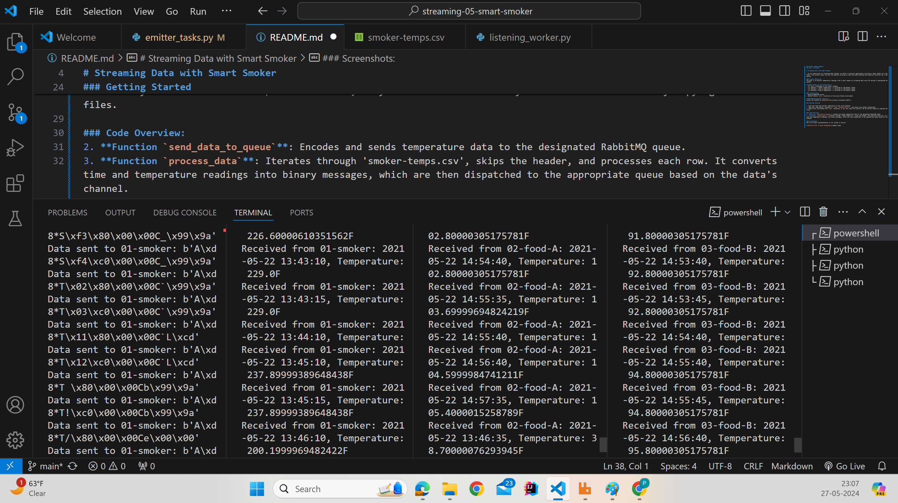

## Pranali Baban Dhobale
## Date: 5/27/2024

# Streaming Data with Smart Smoker

> In our exploration of streaming data systems, we tackle a practical application involving a smart smoker for slow-cooked foods. This project spans the next two modules focusing on real-time data handling and analytics derived from a smart cooking device.

### Project Objective
The goal is to monitor temperature readings from a smart smoker by streaming data every 30 seconds to designated RabbitMQ queues. 

**smoker-temps.csv File Structure:**
- [0] Time = Timestamp of the sensor reading
- [1] Channel1 = Smoker Temperature --> directed to "01-smoker" queue
- [2] Channel2 = Food A Temperature --> directed to "02-food-A" queue
- [3] Channel3 = Food B Temperature --> directed to "03-food-B" queue

### Prerequisites
- Running RabbitMQ server
- Python library `pika` installed in the active Python environment

**RabbitMQ Management Console:**
Access the console at [RabbitMQ Admin](http://localhost:15672/).

### Getting Started

1. Fork and clone the starter repository to your local machine.
2. Open your code editor, navigate to `View / Command Palette`, and select your Python interpreter.
3. Ensure your environment has `pika` installed, or you can reuse the library from an earlier module by copying the relevant files.

### Code Overview:
2. **Function `send_data_to_queue`**: Encodes and sends temperature data to the designated RabbitMQ queue. 
3. **Function `process_data`**: Iterates through 'smoker-temps.csv', skips the header, and processes each row. It converts time and temperature readings into binary messages, which are then dispatched to the appropriate queue based on the data's channel.

### Screenshots:
Here are visual representations of our system in action:

