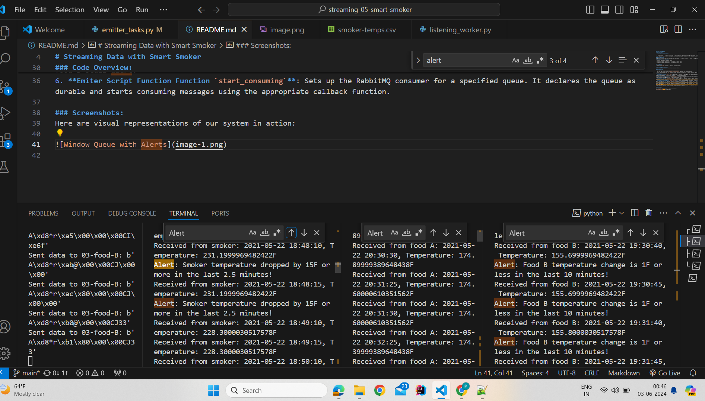

## Pranali Baban Dhobale
## Date: 5/27/2024

# Streaming Data with Smart Smoker

> In our exploration of streaming data systems, we tackle a practical application involving a smart smoker for slow-cooked foods. This project spans the next two modules focusing on real-time data handling and analytics derived from a smart cooking device.

### Project Objective
The goal is to monitor temperature readings from a smart smoker by streaming data every 30 seconds to designated RabbitMQ queues. 

**smoker-temps.csv File Structure:**
- [0] Time = Timestamp of the sensor reading
- [1] Channel1 = Smoker Temperature --> directed to "01-smoker" queue
- [2] Channel2 = Food A Temperature --> directed to "02-food-A" queue
- [3] Channel3 = Food B Temperature --> directed to "03-food-B" queue

### Prerequisites
- Running RabbitMQ server
- Python library `pika` installed in the active Python environment

**RabbitMQ Management Console:**
Access the console at [RabbitMQ Admin](http://localhost:15672/).

### Getting Started

1. Fork and clone the starter repository to your local machine.
2. Open your code editor, navigate to `View / Command Palette`, and select your Python interpreter.
3. Ensure your environment has `pika` installed, or you can reuse the library from an earlier module by copying the relevant files.

### Code Overview:
2. **Emiter Script Function `push_to_queue`**: Establishes a connection to RabbitMQ and sends the encoded temperature data to the designated RabbitMQ queue. It ensures that the queue is declared as durable.queue. 
3. **Emiter Script Function Function `process_csv_and_send`**: Reads the temperature data from 'smoker-temps.csv' every 30 seconds. It skips the header row and processes each subsequent row. It converts the time and temperature readings into binary messages and sends them to the appropriate RabbitMQ queue based on the channel (smoker, food A, or food B).
4. **Emiter Script Function `handle_smoker_queue`**: Handles messages from the smoker queue. It unpacks the binary message, appends the temperature to a deque, and checks if the temperature has dropped by 15°F or more within the last 2.5 minutes. If so, it triggers a smoker alert.
5. **Emiter Script Function Function `handle_food_a_queue`**: Handles messages from the food A queue. It unpacks the binary message, appends the temperature to a deque, and checks if the temperature change is 1°F or less within the last 10 minutes. If so, it triggers a food A stall alert.
6. **Emiter Script Function Function `handle_food_b_queue`**: Handles messages from the food B queue. It unpacks the binary message, appends the temperature to a deque, and checks if the temperature change is 1°F or less within the last 10 minutes. If so, it triggers a food B stall alert.
6. **Emiter Script Function Function `start_consuming`**: Sets up the RabbitMQ consumer for a specified queue. It declares the queue as durable and starts consuming messages using the appropriate callback function.

### Screenshots:
Here are visual representations of our system in action:

